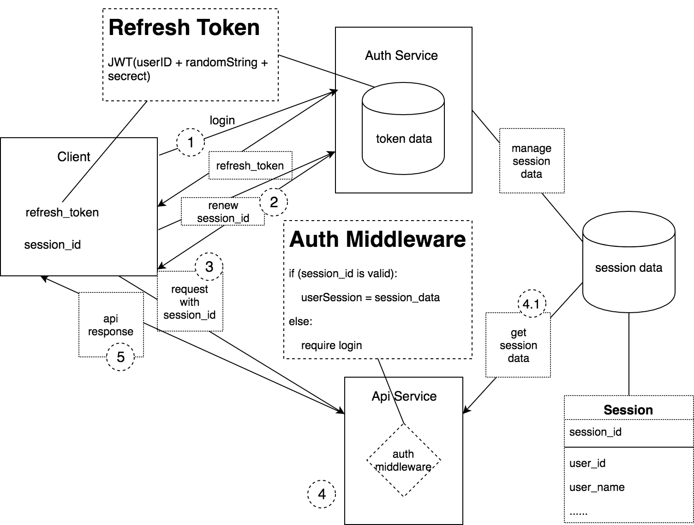

# 安全性相关知识点

## XSS

跨站脚本攻击 Cross Site Scripting

### 原理

XSS 攻击者通过畸形的输入，将恶意的 js 代码插入到了页面中。当其他用户浏览该网页时，恶意的 js 代码会被执行，从而达到攻击的目的。

### 防范

后端不能相信前端的数据,要对用户的输入进行检查、过滤，转义.

---

## CSRF

跨站请求伪造 Cross Site Request Forgery

### 原理

CSRF 可以在受害者毫不知情的情况下以受害者名义发送请求。其原理是借助受害者的 cookie 来骗取服务器的信任。

### 防范方法

给表单添加校验 TOKEN

---

## 同源策略

---

## jwt

JWT 的原理是，服务器认证以后，生成一个 JSON 对象，发回给用户，就像下面这样。

### jwt 三部分

- Header（头部）
- Payload（负载）
- Signature（签名）

### JWT 的使用方式

access_token 短有效期 1 天,长期使用
refresh_token 长有效期 7 天,仅能使用一次,可以存到服务器里面
当 access_token 过期,就用 refresh_token 去获取新的 access_token 并刷新 refresh_token

更好的做法是放在 HTTP 请求的头信息`Authorization`字段里面。

### 实现流程

### 特点

- JWT 默认是不加密，但也是可以加密的。生成原始 Token 以后，可以用密钥再加密一次。
- JWT 不加密的情况下，不能将秘密数据写入 JWT。
- JWT 不仅可以用于认证，也可以用于交换信息。有效使用 JWT，可以降低服务器查询数据库的次数。
- JWT 的最大缺点是，由于服务器不保存 session 状态，因此无法在使用过程中废止某个 token，或者更改 token 的权限。也就是说，一旦 JWT 签发了，在到期之前就会始终有效，除非服务器部署额外的逻辑。
- JWT 本身包含了认证信息，一旦泄露，任何人都可以获得该令牌的所有权限。为了减少盗用，JWT 的有效期应该设置得比较短。对于一些比较重要的权限，使用时应该再次对用户进行认证。
- 为了减少盗用，JWT 不应该使用 HTTP 协议明码传输，要使用 HTTPS 协议传输。

---

## 浏览器存储的特点 session cookie localstorage sessionstorage

---

## 加密算法
