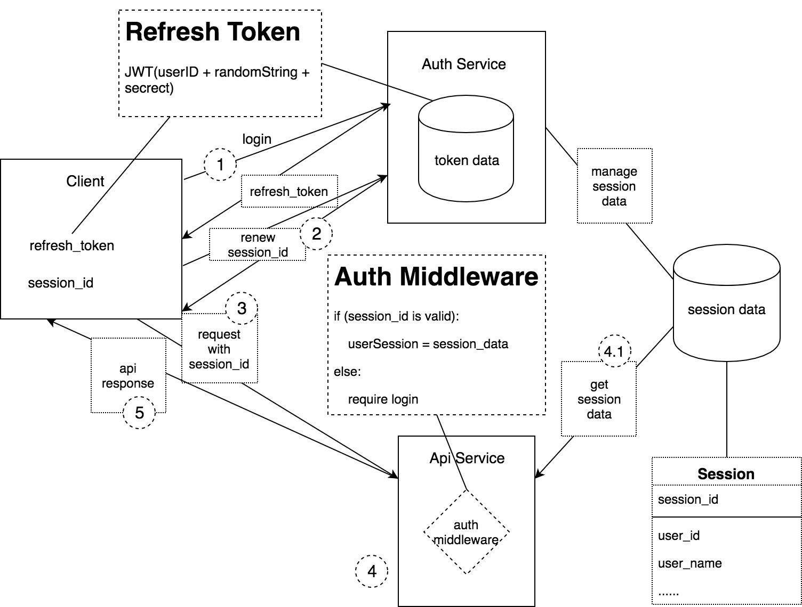

# 安全性相关知识点

## XSS

跨站脚本攻击 Cross Site Scripting

### 原理

XSS 攻击者通过畸形的输入，将恶意的 js 代码插入到了页面中。当其他用户浏览该网页时，恶意的 js 代码会被执行，从而达到攻击的目的。

### 防范

后端不能相信前端的数据,要对用户的输入进行检查、过滤，转义.

---

## CSRF

跨站请求伪造 Cross Site Request Forgery

### 原理

CSRF 可以在受害者毫不知情的情况下以受害者名义发送请求。其原理是借助受害者的 cookie 来骗取服务器的信任。

### 防范方法

给表单添加校验 TOKEN

---

## 同源策略

> 如果两个 URL 的 protocol、port (如果有指定的话)和 host 都相同的话，则这两个 URL 是同源。这个方案也被称为“协议/主机/端口元组”，或者直接是 “元组”。（“元组” 是指一组项目构成的整体，双重/三重/四重/五重/等的通用形式）。

---

## jwt

JWT 的原理是，服务器认证以后，生成一个 JSON 对象，发回给用户，就像下面这样。

### jwt 三部分

- Header（头部）
- Payload（负载）
- Signature（签名）

### JWT 的使用方式

access_token 短有效期 1 天,长期使用
refresh_token 长有效期 7 天,仅能使用一次,可以存到服务器里面
当 access_token 过期,就用 refresh_token 去获取新的 access_token 并刷新 refresh_token

更好的做法是放在 HTTP 请求的头信息`Authorization`字段里面。

### 实现流程

### 特点

- JWT 默认是不加密，但也是可以加密的。生成原始 Token 以后，可以用密钥再加密一次。
- JWT 不加密的情况下，不能将秘密数据写入 JWT。
- JWT 不仅可以用于认证，也可以用于交换信息。有效使用 JWT，可以降低服务器查询数据库的次数。
- JWT 的最大缺点是，由于服务器不保存 session 状态，因此无法在使用过程中废止某个 token，或者更改 token 的权限。也就是说，一旦 JWT 签发了，在到期之前就会始终有效，除非服务器部署额外的逻辑。
- JWT 本身包含了认证信息，一旦泄露，任何人都可以获得该令牌的所有权限。为了减少盗用，JWT 的有效期应该设置得比较短。对于一些比较重要的权限，使用时应该再次对用户进行认证。
- 为了减少盗用，JWT 不应该使用 HTTP 协议明码传输，要使用 HTTPS 协议传输。

---

## 浏览器存储的特点 session cookie localstorage sessionstorage

### cookie

#### 部分特点

- 标记为 Secure 的 Cookie 只应通过被 HTTPS 协议加密过的请求发送给服务端
- 为避免跨域脚本 (XSS) 攻击，通过 JavaScript 的 Document.cookie API 无法访问带有 HttpOnly 标记的 Cookie，它们只应该发送给服务端。

#### 优点

- 存储用户信息,标记用户行为

#### 缺点

- cookie 在 http 请求中,增加了流量
- cookie 不能超过 4KB,数量,长度也有限制
- 浏览器可能禁用 cookie
- cookie 是明文的,有被篡改的潜在风险

#### 安全性问题

- 如果在服务器端 Set-Cookie 时没有设置 HttpOnly=true 时，在浏览器端就可以通过 document.cookie 来读取和修改 Cookie 中的值，这是十分安全的会造成 xss。当 Cookie 中有关键性信息是要设置 HttpOnly=true。
- 设置 cookie 有效时间
- 服务端加密 cookie

### Session

#### 特点

- 可以保存用户的部分敏感信息

### localstorage&sessionstorage

- LS 可以长期保留 SS 在会话结束后会删除
- 大小有 5M

### 总结

#### session 和 cookie 的区别：

session 储存在服务端，cookie 储存在客户端
session 比 cookie 更安全，因为 session 储存在服务端
session 是在服务端保存的一个数据结构，用来跟踪用户的状态，这个数据可以保存在集群、数据库、文件中。
cookie 是客户端保存用户信息的一种机制，用来记录用户的一些信息，也是实现 session 的一种方式。

#### web storage 和 cookie 的区别：

web storages 和 cookie 的作用不同，web storage 是用于本地大容量存储数据(web storage 的存储量大到 5MB);而 cookie 是用于客户端和服务端间的信息传递；
web storage 有 setItem、getItem、removeItem、clear 等方法，cookie 需要我们自己来封装 setCookie、getCookie、removeCookie

---

## 加密算法

---

## DNS 劫持

### 分类

#### 本地 DNS 劫持

客户端侧发生的 DNS 劫持统称为本地 DNS 劫持。本地 DNS 劫持可能是：

- 黑客通过木马病毒或者恶意程序入侵 PC，篡改 DNS 配置(hosts 文件，DNS 服务器地址，DNS 缓存等)。
- 黑客利用路由器漏洞或者破击路由器管理账号入侵路由器并且篡改 DNS 配置。
- 一些企业代理设备（如 Cisco Umbrella intelligent proxy）针对企业内部场景对一些特定的域名做 DNS 劫持解析为指定的结果。

### DNS 劫持防范

- 安装杀毒软件，防御木马病毒和恶意软件；定期修改路由器管理账号密码和更新固件。
- 选择安全技术实力过硬的域名注册商，并且给自己的域名权威数据上锁，防止域名权威数据被篡改。
- 选择支持 DNSSEC 的域名解析服务商，并且给自己的域名实施 DNSSEC。DNSSEC 能够保证递归 DNS 服务器和权威 DNS 服务器之间的通信不被篡改。阿里云 DNS 作为一家专业的 DNS 解析服务厂商，一直在不断完善打磨产品功能，DNSSEC 功能已经在开发中，不日就会上线发布。
- 在客户端和递归 DNS 服务器通信的最后一英里使用 DNS 加密技术，如 DNS-over-TLS，DNS-over-HTTPS 等。
